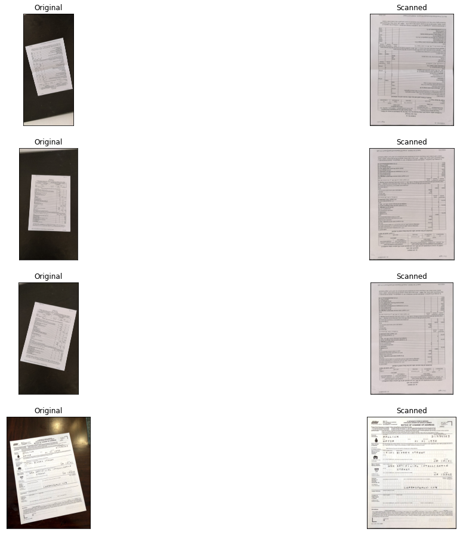

# PiGlasses: Intelligent Text Scanner & Audio Reader

PiGlasses is a cutting-edge wearable smart device powered by Raspberry Pi 3, designed to revolutionize the way users interact with physical documents. By seamlessly integrating a built-in camera and earphones, PiGlasses offers real-time document-to-sound conversion, making it an indispensable tool for various applications.

## Features

- **Smart Document Scanning**: Automatically detects and crops the edges of the document or page being scanned, ensuring precise content capture.
- **Text Recognition**: Utilizes Optical Character Recognition (OCR) to extract text from scanned images with high accuracy.
- **Text-to-Speech Conversion**: Transforms the extracted text into an audio file (`.mp3`), providing an auditory experience.
- **Real-time Audio Playback**: Plays the generated audio file directly through the integrated earphones, offering hands-free listening.

## How It Works

1. The camera embedded in the smart glasses captures an image of a page or document.
2. The automatic document scanner identifies and crops the edges of the paper to focus on the content.
3. OCR (Optical Character Recognition) extracts the text from the image and saves it in a `.txt` file.
4. The extracted text is converted into speech and saved as an `.mp3` file.
5. The `.mp3` file is then played through the smart glasses' earphones, providing hands-free listening.

## Components

- **Raspberry Pi 3**: The main processing unit for the smart glasses.
- **Camera Module**: Captures images of the documents.
- **Automatic Document Scanner**: Detects and crops the edges of the document for text recognition.
- **OCR Software**: Extracts text from images using machine learning.
- **Text-to-Speech Engine**: Converts extracted text into an audio file (`.mp3`).
- **Earphones**: Built into the glasses for audio playback.

## Use Cases

- **Reading Assistance**: Aids visually impaired individuals by converting printed text into speech.
- **Hands-free Reading**: Enables users to listen to scanned documents without the need to manually read or hold the document.
- **Educational Tool**: Supports students and educators by converting textbooks or lecture notes into audio format.

## Requirements

- Raspberry Pi 3
- Camera module
- Python
- OpenCV
- Tesseract OCR
- Text-to-Speech (e.g., gTTS)

## Installation

1. Clone the repository:

   ```bash
   git clone https://github.com/subhashbs36/PiGlasses-Intelligent-Text-Scanner-Audio-Reader
   ```

2. Install required Python packages:

   ```bash
   pip install -r requirements.txt
   ```

3. Run the application:

   ```bash
   python app.py
   ```

## Results



The image above demonstrates the successful conversion of a scanned document efficiently and effectiveness of PiGlasses.

## Future Improvements

1. Real-time Language Translation: Translating extracted text into different languages.
2. Improved Text Recognition: Using advanced AI models for higher accuracy.
3. Compact Design: Further miniaturization of hardware for a sleeker, more portable design.

